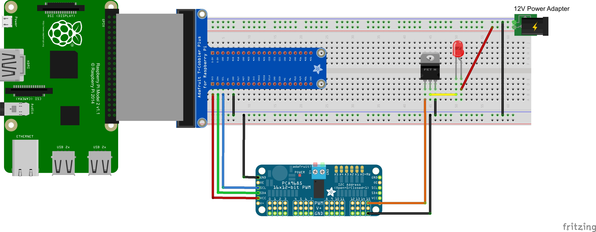

# flask-leds

A Flask server to control an LED strip from the Raspberry Pi using an [Adafruit PCA9685](https://www.adafruit.com/product/815).

## Setting up the Raspberry Pi

Start from a Raspbian Lite installation

### Install system software:

    sudo apt-get install vim samba samba-common-bin python3-pip libffi-dev
	
### Install Adafruit PWM driver

    sudo apt-get install git build-essential python-dev
    cd ~
    git clone https://github.com/adafruit/Adafruit_Python_PCA9685.git
    cd Adafruit_Python_PCA9685
    sudo python3 setup.py install
    
### Install and configure `virtualenv` and `virtualenvwrapper`

    sudo pip3 install virtualenv
    sudo pip3 install virtualenvwrapper
        
    mkdir ~/projects
        
Add these lines to .profile:

    export WORKON_HOME=$HOME/.virtualenvs
    export PROJECT_HOME=$HOME/projects
    export VIRTUALENVWRAPPER_PYTHON=/usr/bin/python3
    source /usr/local/bin/virtualenvwrapper.sh

Reload .profile with `source .profile`        

## Set up Flask project

    mkproject <projectname>
    pip install Flask Adafruit_PCA9685

## Set up virtualenvwrapper hooks for the leds project

Copy the contents of the `virtualenvwrapper` directory to ~/.virtualenvs/leds/bin

## Run the server

    workon leds
    flask run -h 0.0.0.0

## Wiring diagram

An LED Strip tutorial at Adafruit:

[LED Strips](https://learn.adafruit.com/rgb-led-strips)

This shows wiring for a single LED.

From: [Adafruit forum](https://forums.adafruit.com/viewtopic.php?f=19&t=92144&p=466769&hilit=Pca9685#p466769)